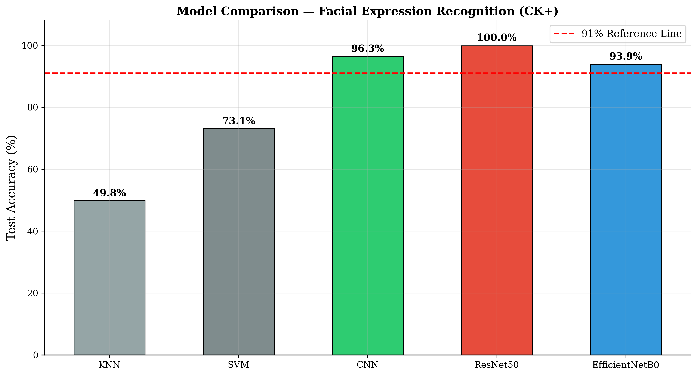
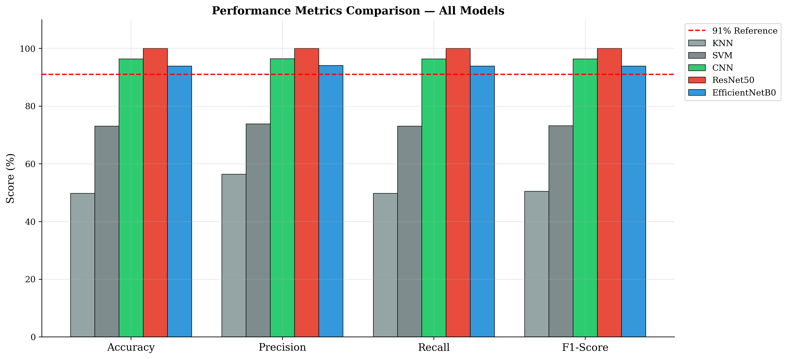

# FER_2026 — Facial Expression Recognition

**A comparative study of 5 deep-learning architectures — with KNN and SVM as classical ML baselines — for 7-class facial expression recognition on the CK+ dataset.**


---

## Overview

Every model in this study is trained and evaluated under an **identical protocol** so the comparison is fair:

- **Same dataset:** CK+ (Extended Cohn-Kanade), 7 emotion classes
- **Same balanced corpus:** every class augmented up to 350 images → 2,450 images total
- **Same split:** stratified 80% train / 10% val / 10% test, fixed seed (42)
- **Same training loop:** shared Adam + cosine-annealing scheduler, best-validation checkpointing (single implementation in `src/utils.py`)

### Models Compared

| Model | Family | Params | Strategy |
|-------|--------|--------|----------|
| KNN (k=3) | Classical ML baseline | — | 48×48 grayscale flattened pixels + StandardScaler |
| SVM (RBF, C=10) | Classical ML baseline | — | same flat features, probability estimates |
| Custom CNN | Deep, from scratch | ~0.5M | 4 conv+BN blocks (32→64→128→256), random init |
| VGG16 | Deep, transfer learning | ~138M | ImageNet init, fine-tune last conv block + head |
| MobileNetV2 | Deep, transfer learning | ~3.5M | ImageNet init, fine-tune last block + head |
| ResNet50 | Deep, transfer learning | ~25M | ImageNet init, fine-tune layer4 + head |
| EfficientNetB0 | Deep, transfer learning | ~5.3M | ImageNet init, fine-tune features.7/8 + head |

The classical baselines answer the question *"what do the deep models buy me?"*; the four transfer-learning backbones span four genuinely different architecture families (plain stacked convs, inverted residuals, residual blocks, compound-scaled MBConv).

---

## Results

> Numbers below are produced automatically by the pipeline (`metrics_summary.csv` → `src/11_compare_models.py`). Regenerate them any time with `python evaluate.py` — no retraining needed.

| Model | Type | Accuracy | Precision | Recall | F1-Score |
|-------|------|----------|-----------|--------|----------|
| _first full training run pending — execute `python train_all.py` to fill this table_ | | | | | |




Per-model training curves and confusion matrices live in `figures/` (`{model}_training_curves.png`, `{model}_confusion_matrix.png`).
---

## Dataset — CK+

| Property | Value |
|----------|-------|
| Source | [Extended Cohn-Kanade (CK+)](https://www.kaggle.com/datasets/shawon10/ckplus), downloaded via `kagglehub` |
| Classes | 7 — anger, contempt, disgust, fear, happiness, sadness, surprise |
| Original images | 981 (uneven across classes: 54 contempt → 249 surprise) |
| Balancing | augmentation (flip / rotate / jitter / affine shift) up to 350 per class |
| Final size | 2,450 images @ 224×224 |
| Split | 80/10/10 train/val/test, stratified, seed 42 |

The raw dataset is **not committed** — `src/01_download_data.py` re-downloads it on demand (requires a free Kaggle API token).

---

## Pipeline

```
01_download_data.py      Kaggle (CK+) -> data/raw/
        |
02_preprocess_data.py    balance classes -> stratified split -> manifest.csv
        |
        +-----------------------------+
        |                             |
03_feature_engineering.py      06..10 deep models
   48x48 flat + scaler          224x224 ImageNet-normalized
        |                             |
04_model_knn.py                06_model_cnn.py
05_model_svm.py                07_model_vgg16.py
                               08_model_mobilenetv2.py
                               09_model_resnet50.py
                               10_model_efficientnet.py
        |                             |
        +------------> metrics_summary.csv
                              |
                     11_compare_models.py  ->  figures/comparison_*.png
                              |
                     12_live_demo.py  (Gradio, one button per model)
```

---

## Quick Start

```bash
# 1. Environment (Python 3.10, CUDA-capable PyTorch)
conda activate ml
pip install -r requirements.txt
# GPU build of PyTorch, e.g. CUDA 12.1:
#   pip install torch==2.5.1 torchvision==0.20.1 --index-url https://download.pytorch.org/whl/cu121

# 2. Kaggle token (free) — see src/01_download_data.py for details
#    kaggle.com -> Settings -> API -> Create New Token, then either:
#      set KAGGLE_API_TOKEN=KGAT_xxxx        (one-off)
#      or save it to ~/.kaggle/access_token  (persistent)

# 3. Run everything in one command (download -> preprocess -> 7 models -> comparison)
python train_all.py

# 4. Rebuild all metrics + figures from saved checkpoints (no retraining)
python evaluate.py

# 5. Live demo — upload a face, run any of the 7 models
python src/12_live_demo.py
```

Prefer running step by step? Execute `src/01_download_data.py` → `02` → `03` → `04`–`10` (any order) → `11_compare_models.py`.
---

## Project Structure

```
FER_2026/
├── config.py                     # all paths, constants, seeds, palettes
├── train_all.py                  # one-command pipeline runner (subprocess per model)
├── evaluate.py                   # regenerate metrics/figures from checkpoints
├── metrics_summary.csv           # committed results table (auto-generated)
├── src/
│   ├── 01_download_data.py       # CK+ via kagglehub
│   ├── 02_preprocess_data.py     # balancing + stratified split + manifest
│   ├── 03_feature_engineering.py # flat features + scaler for KNN/SVM
│   ├── 04_model_knn.py           # baseline 1
│   ├── 05_model_svm.py           # baseline 2
│   ├── 06_model_cnn.py           # custom CNN from scratch
│   ├── 07_model_vgg16.py         # VGG16 fine-tuning
│   ├── 08_model_mobilenetv2.py   # MobileNetV2 fine-tuning
│   ├── 09_model_resnet50.py      # ResNet50 fine-tuning
│   ├── 10_model_efficientnet.py  # EfficientNetB0 fine-tuning
│   ├── 11_compare_models.py      # comparison charts from metrics_summary.csv
│   ├── 12_live_demo.py           # Gradio demo, 7 independent model buttons
│   └── utils.py                  # dataset, transforms, train loop, plotting
├── figures/                      # committed: curves, confusion matrices, comparisons
├── models/                       # checkpoints (gitignored, retrainable)
├── data/                         # dataset (gitignored, re-downloadable)
├── output/                       # live-demo screenshots (gitignored)
└── tests/                        # CPU smoke tests (run by CI)
```

---

## Reproducibility Notes

- Global seed 42 (Python / NumPy / PyTorch) set before every stochastic step
- Scaler for KNN/SVM fitted on the training split only (no leakage)
- Deep models checkpoint only on best **validation** accuracy, then reload that checkpoint for the final **test** evaluation
- Transfer models keep early layers frozen at ImageNet weights; only the last feature block + classification head train (LR 1e-4 vs 1e-3 for the from-scratch CNN)

**Hardware used:** NVIDIA GeForce RTX 3060 (12 GB) · training time ≈ 10–20 min per deep model at 30 epochs.

---

## License

MIT
